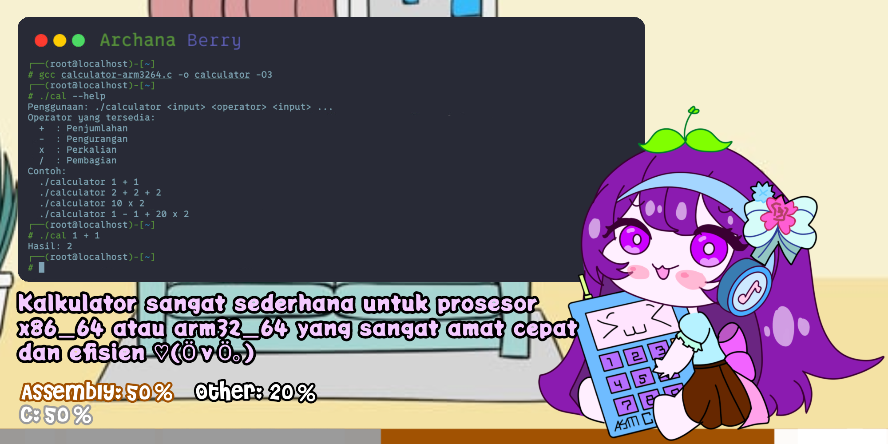
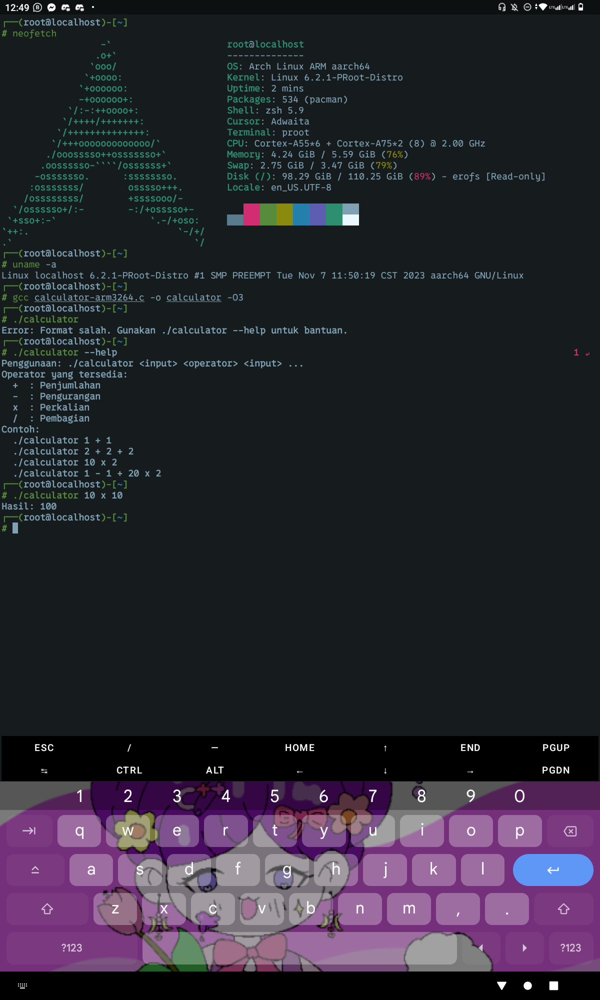

# Kalkulator Sederhana Assembly - x86_64 & ARM32/ARM64


Kalkulator ini dibuat menggunakan bahasa C dan instruksi assembly untuk operasi aritmatika dasar. Program mendukung arsitektur **x86_64** dan **ARM32/ARM64** dengan menggunakan assembly untuk operasi yang lebih cepat dan ringan.

## Deskripsi

Program kalkulator ini mendukung empat operator dasar:
- **+** : Penjumlahan
- **-** : Pengurangan
- **x** : Perkalian
- **/** : Pembagian

Program menggunakan instruksi assembly untuk meningkatkan kinerja kalkulasi.

## Cara Menggunakan

## Cara Kompilasi

### Untuk x86_64
1. Kompilasi dengan GCC:
2. contoh kompilasi agar efisien dan lebih cepat pakai opsi flag -O3 (optimalisasi level 3)
3. ```
   gcc <file program kalkulator.c nya> -o <penamaan program contoh "kalkulator"> <opsi optimalisasi>
   ```
   seperti ini kalau untuk prosesor x86_64 (32bit dan 64bit) misal Intel dan AMD
   ```
   gcc calculator-x8664.c -o calculator -O3
   ```
   atau kalau untuk prosesor ARM dari 32bit dan 64bit misal Snapdragon, Mediatek, dan Unisoc, dll
	 ```
   gcc calculator-arm3264.c -o calculator -03
   ```
   Setelah berhasil dikompilasi, Anda dapat menjalankan program dengan:
   ```
   ./calculator <input> <operator> <input> ...
   ```
4. Jika salah pemilihan versi arsitektur tidak dapat membuat aplikasi nya karena tidak cocok dengan set instruksi di prosesor anda!!!

### Menjalankan Kalkulator
Untuk menjalankan kalkulator, gunakan sintaks berikut di terminal:
```
./calculator <input> <operator> <input> ...
```

Contoh penggunaan:
```
./calculator 1 + 1
```
Hasil: `2`

```
./calculator 2 + 2 + 2
```
Hasil: `6`

```
./calculator 10 x 2
```
Hasil: `20`

```
./calculator 1 - 1 + 20 x 2
```
Hasil: `40`

### Bantuan
Untuk melihat bantuan dan informasi tentang cara penggunaan, jalankan perintah berikut:
```
./calculator --help
```

Output:
```
Penggunaan: ./calculator <input> <operator> <input> ...
Operator yang tersedia:
  +  : Penjumlahan
  -  : Pengurangan
  x  : Perkalian
  /  : Pembagian
Contoh:
  ./calculator 1 + 1
  ./calculator 2 + 2 + 2
  ./calculator 10 x 2
  ./calculator 1 - 1 + 20 x 2
```

### Untuk ARM32/ARM64
Jika Anda ingin menggunakan arsitektur ARM32 atau ARM64, Anda dapat memodifikasi file sumber untuk menyesuaikan instruksi assembly dengan masing-masing arsitektur, dan mengikuti langkah kompilasi yang sesuai dengan sistem Anda.

## Penjelasan File Assembly

### `calculator-x8664.asm`

File `calculator-x8664.asm` berisi kode assembly yang digunakan untuk operasi aritmatika pada arsitektur **x86_64**. Di dalamnya, Anda akan menemukan instruksi untuk:
- **Penjumlahan** (`addq`)
- **Pengurangan** (`subq`)
- **Perkalian** (`imulq`)
- **Pembagian** (`idivq`)

Instruksi ini disesuaikan untuk bekerja dengan register dan struktur data pada sistem **x86_64**, dan digunakan dalam program C untuk meningkatkan performa perhitungan.

### `calculator-arm3264.asm`

File `calculator-arm3264.asm` berisi kode assembly yang digunakan untuk operasi aritmatika pada arsitektur **ARM32** dan **ARM64**. Di dalamnya, instruksi-instruksi berikut digunakan:
- **Penjumlahan** (`ADD`)
- **Pengurangan** (`SUB`)
- **Perkalian** (`MUL`)
- **Pembagian** (`SDIV`)

File ini memungkinkan kalkulator untuk bekerja dengan arsitektur ARM, dengan instruksi assembly yang disesuaikan untuk ARM32 dan ARM64.

## Tangkapan Layar


## Potongan kode operasi aritmatika di i386, dan x86_64 (32bit dan 64bit)
```
// Fungsi untuk menghitung operasi aritmatika
long calculate(long num1, char op, long num2) {
    long result;

    #if defined(__x86_64__) // Untuk arsitektur x86_64 atau AMD64
        switch(op) {
            case '+':
                __asm__ (
                    "addq %1, %0;"        // result = num1 + num2
                    : "=r" (result)
                    : "r" (num2), "0" (num1)
                );
                break;
            case '-':
                __asm__ (
                    "subq %1, %0;"        // result = num1 - num2
                    : "=r" (result)
                    : "r" (num2), "0" (num1)
                );
                break;
            case 'x': // Perkalian
                __asm__ (
                    "imulq %1, %0;"       // result = num1 * num2
                    : "=r" (result)
                    : "r" (num2), "0" (num1)
                );
                break;
            case '/': // Pembagian
                if (num2 == 0) {
                    printf("Error: Pembagian dengan nol tidak diperbolehkan!\n");
                    exit(1);
                }
                __asm__ (
                    "cqto;"               // Convert to quadword untuk pembagian
                    "idivq %2;"           // result = num1 / num2
                    : "=a" (result)
                    : "d" (num1), "r" (num2)
                );
                break;
            default:
                printf("Operator tidak dikenal!\n");
                exit(1);
        }
    #elif defined(__i386__) // Untuk arsitektur x86 (32-bit)
        switch(op) {
            case '+':
                __asm__ (
                    "addl %1, %0;"        // result = num1 + num2
                    : "=r" (result)
                    : "r" (num2), "0" (num1)
                );
                break;
            case '-':
                __asm__ (
                    "subl %1, %0;"        // result = num1 - num2
                    : "=r" (result)
                    : "r" (num2), "0" (num1)
                );
                break;
            case 'x': // Perkalian
                __asm__ (
                    "imull %1, %0;"       // result = num1 * num2
                    : "=r" (result)
                    : "r" (num2), "0" (num1)
                );
                break;
            case '/': // Pembagian
                if (num2 == 0) {
                    printf("Error: Pembagian dengan nol tidak diperbolehkan!\n");
                    exit(1);
                }
                __asm__ (
                    "cltd;"               // Convert to doubleword untuk pembagian
                    "idivl %2;"           // result = num1 / num2
                    : "=a" (result)
                    : "d" (num1), "r" (num2)
                );
                break;
            default:
                printf("Operator tidak dikenal!\n");
                exit(1);
        }
    #else
        printf("Arsitektur tidak didukung! Hanya mendukung x86 dan x86_64.\n");
        exit(1);
    #endif

    return result;
}
```

## Potongan kode operasi aritmatika di ARM 32bit dan 64bit (Aarch)
```
// Fungsi untuk menghitung operasi aritmatika
long calculate(long num1, char op, long num2) {
    long result;

    switch(op) {
        case '+':
            #if defined(__arm__) || defined(__aarch32__) // ARM32
                __asm__ (
                    "add %0, %1, %2;"    // result = num1 + num2
                    : "=r" (result)
                    : "r" (num1), "r" (num2)
                );
            #elif defined(__aarch64__) // ARM64
                __asm__ (
                    "add %0, %1, %2;"    // result = num1 + num2
                    : "=r" (result)
                    : "r" (num1), "r" (num2)
                );
            #else
                printf("Arsitektur tidak didukung!\n");
                exit(1);
            #endif
            break;
        case '-':
            #if defined(__arm__) || defined(__aarch32__) // ARM32
                __asm__ (
                    "sub %0, %1, %2;"    // result = num1 - num2
                    : "=r" (result)
                    : "r" (num1), "r" (num2)
                );
            #elif defined(__aarch64__) // ARM64
                __asm__ (
                    "sub %0, %1, %2;"
                    : "=r" (result)
                    : "r" (num1), "r" (num2)
                );
            #else
                printf("Arsitektur tidak didukung!\n");
                exit(1);
            #endif
            break;
        case 'x': // Perkalian
            #if defined(__arm__) || defined(__aarch32__) // ARM32
                __asm__ (
                    "mul %0, %1, %2;"    // result = num1 * num2
                    : "=r" (result)
                    : "r" (num1), "r" (num2)
                );
            #elif defined(__aarch64__) // ARM64
                __asm__ (
                    "mul %0, %1, %2;"
                    : "=r" (result)
                    : "r" (num1), "r" (num2)
                );
            #else
                printf("Arsitektur tidak didukung!\n");
                exit(1);
            #endif
            break;
        case '/': // Pembagian
            if (num2 == 0) {
                printf("Error: Pembagian dengan nol tidak diperbolehkan!\n");
                exit(1);
            }
            #if defined(__arm__) || defined(__aarch32__) // ARM32
                __asm__ (
                    "sdiv %0, %1, %2;"   // result = num1 / num2
                    : "=r" (result)
                    : "r" (num1), "r" (num2)
                );
            #elif defined(__aarch64__) // ARM64
                __asm__ (
                    "sdiv %0, %1, %2;"
                    : "=r" (result)
                    : "r" (num1), "r" (num2)
                );
            #else
                printf("Arsitektur tidak didukung!\n");
                exit(1);
            #endif
            break;
        default:
            printf("Operator tidak dikenal!\n");
            exit(1);
    }
    return result;
}
```

## Kontribusi

Jika Anda ingin berkontribusi dalam pengembangan kalkulator ini, silakan lakukan fork repository ini, buat cabang (branch), lakukan perubahan, dan ajukan pull request.

## Lisensi

Proyek ini dilisensikan di bawah **Creative Common License** - lihat [LICENSE](LICENSE) untuk detail lebih lanjut.
